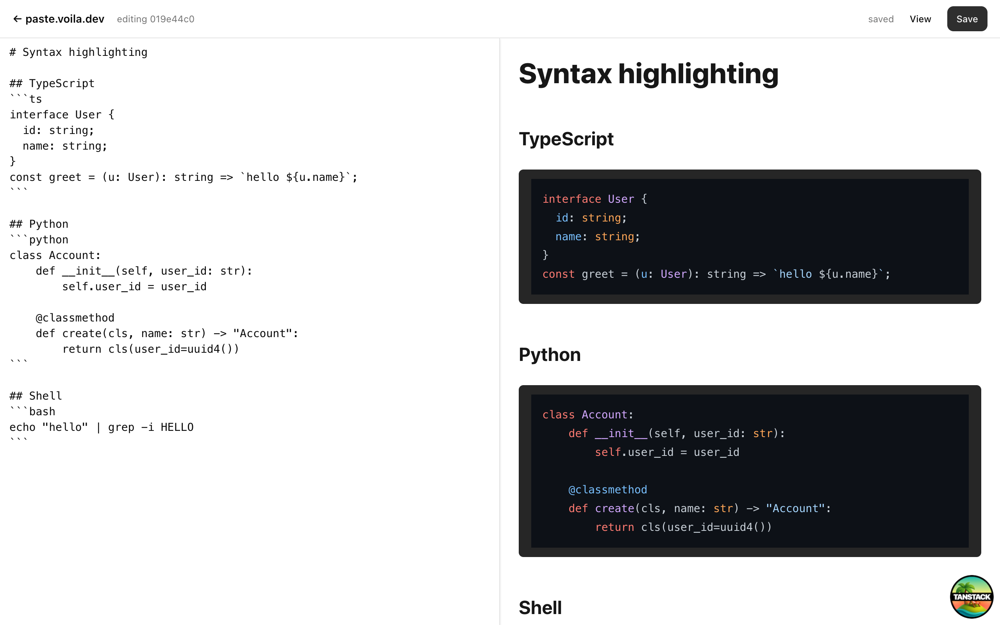

<div align="center">

# paste.voila.dev

**Markdown pastebin. No auth. Edge-native.**

A tiny, fast, open-source pastebin for sharing Markdown. UUIDv7 ids, edit tokens in URL fragments, syntax highlighting, public/unlisted visibility, rate-limited at the edge.

[**Live demo →**](https://paste.voila.dev)

[](https://github.com/voila-voila-dev/paste.voila.dev/releases)
[](https://workers.cloudflare.com/)
[](https://tanstack.com/start)
[](https://developers.cloudflare.com/d1/)
[](https://bun.sh)
[](LICENSE)
[](https://www.conventionalcommits.org/)

</div>

<p align="center">
  
</p>

---

## Why

Pastebins have not moved in a decade. They are slow, ad-ridden, or want your account. `paste.voila.dev` is the opposite:

- **Zero accounts.** Every paste gets a UUIDv7 and a secret edit token. Share the read-only URL freely; share the edit URL only with people you trust.
- **One file.** Deploys as a single Cloudflare Worker. The whole app, including SSR and server functions, runs at the edge.
- **No tracking.** No cookies, no analytics, no ads. `robots.txt` is `Disallow: /` by default — pastes won't get indexed.
- **Yours.** MIT-licensed, ~1.5k lines, easy to fork and self-host.

## Features

- Live split editor with rendered preview
- Syntax highlighting for 190+ languages via `highlight.js`
- Optional title (auto-detected from the first `# h1` in the first 10 lines)
- **Public / unlisted** visibility — unlisted pastes are reachable only by URL
- Edit token stored in the URL fragment (`#tk=…`) so it never hits server logs
- Per-IP rate limiting (5 creates/min, 20 edits/min) via Cloudflare's Rate Limiting binding
- Download as `.md` or fetch raw text (`/{id}/raw`, `/{id}/download`)
- Your own pastes remembered in `localStorage` (id + edit token) for return visits
- Delete with edit token
- Site-wide Geist Mono. Because everything's better in mono.

## Quick start

```bash
git clone git@github.com:voila-voila-dev/paste.voila.dev.git
cd paste.voila.dev
bun install
bun run db:migrate:local
bun run dev
```

Open <http://localhost:3069>.

## Stack

| Layer        | Choice                                                                 |
| ------------ | ---------------------------------------------------------------------- |
| Runtime      | [Bun](https://bun.sh) + [Cloudflare Workers](https://workers.cloudflare.com/) |
| Framework    | [TanStack Start](https://tanstack.com/start) (front + back, one app)  |
| Routing      | [TanStack Router](https://tanstack.com/router) (file-based, type-safe) |
| Forms        | [TanStack Form](https://tanstack.com/form)                            |
| Database     | [Cloudflare D1](https://developers.cloudflare.com/d1/) (SQLite at the edge) |
| ORM          | [Drizzle](https://orm.drizzle.team/)                                  |
| UI           | [shadcn-style](https://ui.shadcn.com) primitives on top of [Base UI](https://base-ui.com) |
| Styling      | [Tailwind v4](https://tailwindcss.com) + `@tailwindcss/typography`    |
| Validation   | [Zod](https://zod.dev)                                                |
| Lint/Format  | [Biome](https://biomejs.dev)                                          |

## Architecture

The repo is a Bun workspaces monorepo with a clear domain boundary.

```
.
├── apps/
│   └── paste.voila.dev      # TanStack Start app + Wrangler config
│       └── src/
│           ├── routes/      # File-based routes (incl. server handlers)
│           ├── server/      # Server functions (createServerFn)
│           └── lib/         # markdown rendering, localStorage, formatting
└── packages/
    ├── domain/              # Pure types: Paste, Visibility, repository interface
    ├── architecture/        # Drizzle schema + DrizzlePasteRepository (D1)
    └── ui/                  # shadcn-style components on Base UI primitives
```

A few intentional choices:

- **DDD-lite hexagonal layout.** Domain has no framework deps. Architecture implements repositories against D1. The app wires them together.
- **Server functions over REST.** `createServerFn` gives end-to-end type safety with Zod input validators. Static file routes (`raw`, `download`) use the `server.handlers` config.
- **No client-side router state for tokens.** Edit tokens live in the URL fragment, never in localStorage as the source of truth — localStorage is a convenience cache only.

## Local development

You need [Bun](https://bun.sh) `>= 1.2.23` and [Wrangler](https://developers.cloudflare.com/workers/wrangler/) (installed via the workspace).

```bash
bun install                  # install all workspace deps
bun run db:migrate:local     # initialize local D1 (.wrangler/state)
bun run dev                  # http://localhost:3069
```

Useful scripts:

| Command                          | What it does                                                 |
| -------------------------------- | ------------------------------------------------------------ |
| `bun run dev`                    | Start the dev server on `:3069` with miniflare-emulated D1   |
| `bun run build`                  | Build the production Worker bundle                           |
| `bun run deploy`                 | `wrangler deploy` to Cloudflare                              |
| `bun run db:generate`            | Generate a new Drizzle migration from the schema             |
| `bun run db:migrate:local`       | Apply migrations to the local D1                             |
| `bun run db:migrate:remote`      | Apply migrations to the production D1                        |
| `bun run check`                  | Biome lint + format check                                    |
| `bun run format`                 | Biome format fix                                             |

## Deployment

The app deploys as a single Cloudflare Worker with one D1 database and two rate-limit bindings.

### One-time setup

```bash
# Create the D1 database (writes its id into wrangler.jsonc on confirm)
bunx wrangler d1 create paste-voila

# Apply migrations to production
bun run db:migrate:remote
```

Set the following GitHub Actions secrets to enable CI:

| Secret                   | Where to get it                                                                              |
| ------------------------ | -------------------------------------------------------------------------------------------- |
| `CLOUDFLARE_API_TOKEN`   | <https://dash.cloudflare.com/profile/api-tokens> — "Edit Cloudflare Workers" template        |
| `CLOUDFLARE_ACCOUNT_ID`  | Cloudflare dashboard sidebar                                                                 |

### Workflows

- `.github/workflows/preview.yml` — on every PR, builds and `wrangler versions upload`, posts the preview URL as a PR comment.
- `.github/workflows/deploy.yml` — on push to `main`, applies remote migrations, then `wrangler deploy`.

## HTTP API

Server functions are called by the SPA via TanStack Start's RPC. The plain HTTP endpoints below are stable and curl-friendly.

| Method | Path                | Response                            |
| ------ | ------------------- | ----------------------------------- |
| `GET`  | `/{id}/raw`         | `text/markdown` — raw paste content |
| `GET`  | `/{id}/download`    | `text/markdown` with `Content-Disposition: attachment` |

For everything else, talk to the app:

- `GET /` — home, create form + recent pastes
- `GET /{id}` — view rendered paste
- `GET /{id}/edit#tk={token}` — editor (edit token in fragment)

## Configuration

Everything lives in `apps/paste.voila.dev/wrangler.jsonc`:

- `d1_databases[].DB` — the D1 binding used by the repository
- `unsafe.bindings.CREATE_LIMITER` / `UPDATE_LIMITER` — Cloudflare rate-limit bindings (5/min and 20/min by default)
- `routes` — custom domain (`paste.voila.dev`)

Re-run `bunx wrangler types` whenever you edit bindings to regenerate `worker-configuration.d.ts`.

## Contributing

Contributions are welcome. To keep the project small and focused:

1. Open an issue first for anything non-trivial.
2. Run `bun run check` before pushing.
3. Don't introduce new top-level dependencies without a strong reason — every kilobyte ships to the edge.
4. Keep the domain package framework-agnostic.
5. Use [Conventional Commits](https://www.conventionalcommits.org/) — they drive the changelog.

### Conventional Commits

Commits on `main` follow Conventional Commits. The supported prefixes:

| Prefix     | When to use                                                 | Bumps     |
| ---------- | ----------------------------------------------------------- | --------- |
| `feat:`    | New user-visible functionality                              | **minor** |
| `fix:`     | Bug fix                                                     | **patch** |
| `perf:`    | Performance improvement                                     | **patch** |
| `refactor:`| Internal change, no behavior difference                     | none      |
| `docs:`    | README / docs only                                          | none      |
| `build:`   | Build system, deps, Wrangler config                         | none      |
| `ci:`      | GitHub Actions                                              | none      |
| `chore:`   | Misc (won't appear in changelog)                            | none      |
| `test:`    | Tests only                                                  | none      |

Add `!` for a breaking change (`feat!: drop /raw endpoint`) or include `BREAKING CHANGE:` in the body — that triggers a **major** bump.

### How releases happen

[release-please](https://github.com/googleapis/release-please) watches `main`. When it sees commits that warrant a release, it opens (or updates) a "release PR" with the version bump and a generated `CHANGELOG.md` entry. Merge the PR — release-please tags `vX.Y.Z`, creates a GitHub release, and the regular deploy workflow ships it.

That's it: no manual versioning, no manual changelog.

## Acknowledgements

Inspired by [dpaste](https://dpaste.com) and the original [pastebin.com](https://pastebin.com), built on the shoulders of the TanStack and Cloudflare teams.

## License

[MIT](LICENSE) © Voila
